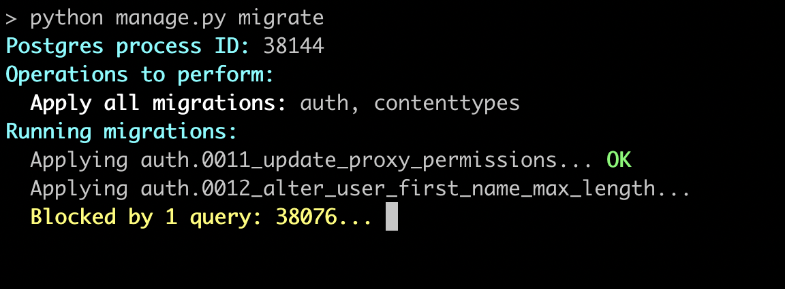

.. _manual:

Manually Terminating Blocking Queries
=====================================

If it's not desirable to automatically terminate queries, you
can configure ``django-pgmigrate`` to show the blocking queries
so that they can be manually handled.

Set ``settings.PGMIGRATE_BLOCKING_ACTION`` to ``pgmigrate.Show`` to
configure this behavior. For example, in ``settings.py``:

.. code-block:: python

    import pgmigrate

    PGMIGRATE_BLOCKING_ACTION = pgmigrate.Show

Here's an example of what it looks like:

In the above, a warning message is printed when blocking activities
are found. The Postgres process IDs of the activities are printed.
Queries will remain blocked until they finish or are manually terminated.

Manually Inspecting and Terminating Queries
-------------------------------------------

``django-pgmigrate`` automatically installs the
`django-pgactivity <https://django-pgactivity.readthedocs.io>`__ library, which
makes it easy to view and terminate active queries.

Our original example printed a blocking ID of ``38076``.
We can run the following to show the duration of the query and the SQL::

    python manage.py pgactivity 38076

Output looks like this::

    38076 | 0:00:36 | IDLE_IN_TRANSACTION | None | select * from auth_user;

The second column is the duration of the query. The final column is the SQL.
You can terminate the query with::

    python manage.py pgactivity 38076 --terminate

Once the query is terminated, migrations will continue.

.. tip::

    The ``pgactivity`` command can take multiple process IDs. These can
    be directly copied from the output of the ``pgmigrate`` command.

Adding Application Context to Queries
-------------------------------------

The `django-pgactivity <https://django-pgactivity.readthedocs.io>`__ library
comes with middleware to automatically annotate the URL that issued the SQL
statement, adding more information to help you understand where queries originate.
Add ``pgactivity.middleware.ActivityMiddleware`` to ``settings.MIDDLEWARE``,
and ``python manage.py pgactivity`` will also show the application context in the
results.

Once configured, our example output from above would look like this::

   38076 | 0:00:36 | IDLE_IN_TRANSACTION | {'url': '/admin/', 'method': 'GET'} | select * from auth_user;

We recommend `reading the django-pgactivity docs <https://django-pgactivity.readthedocs.io>`__ 
to learn more about how it works, along with learning how to add context to management commands and
background tasks. The docs also explain how to configure the ``pgactivity`` command for other
use cases.
