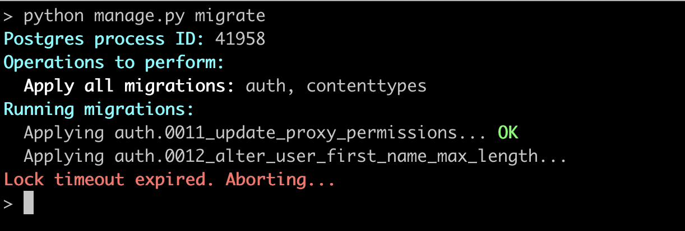

# Setting the Lock Timeout

Configure the lock timeout for migrations using `settings.PGMIGRATE_LOCK_TIMEOUT` by supplying a Python `datetime.timedelta` object. For example, the following configures the lock timeout to be five seconds:

```python
import datetime

PGMIGRATE_LOCK_TIMEOUT = datetime.timedelta(seconds=5)
```

When using the above configuration, any migration statement that waits over five seconds to acquire a lock will be terminated.

Here's what it looks like when running migrations:



We recommend using the lock timeout as a safeguard to ensure migrations don't block for too long. For example, if you've followed the guide in the [Manually Terminating Blocking Queries](manual.md) section, you can show blocking queries *and* automatically stop migrations if you are unable to terminate blocking activity in time.

!!! note

    Remember, this configures the lock timeout and *not* the statement timeout. In other words, your migration statements can still run as long as needed after they've acquired locks.